<div align="center">

<a href="https://openpocketcine.app/">
  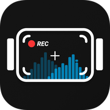
</a>

# OpenPocketCine

**The open field monitor for DJI Osmo.**<br>
Pro scopes, exposure assists, camera and gimbal control, playback and LUT export on your phone.
Free and open source.

[](https://github.com/erik-sutton95/OpenPocketCine/actions/workflows/ci.yml) [](https://openpocketcine.app/docs/) [](LICENSE) [](https://github.com/erik-sutton95/OpenPocketCine/discussions)

[](https://testflight.apple.com/join/1tmt3aEB) [](https://play.google.com/store/apps/details?id=com.opencapture.openpocketcine&hl=en-US&ah=mXzHtdYCMQTB83vt0jIRLnOOZaA) [](https://github.com/erik-sutton95/OpenPocketCine/releases/tag/sideload-v0.1.5-2)

[Website](https://openpocketcine.app/) · [Docs](https://openpocketcine.app/docs/) · [Roadmap](https://github.com/erik-sutton95/OpenPocketCine/discussions/categories/ideas) · [Report a bug](https://github.com/erik-sutton95/OpenPocketCine/issues/new?template=bug_report.yml)

<br>

<a href="https://openpocketcine.app/">
  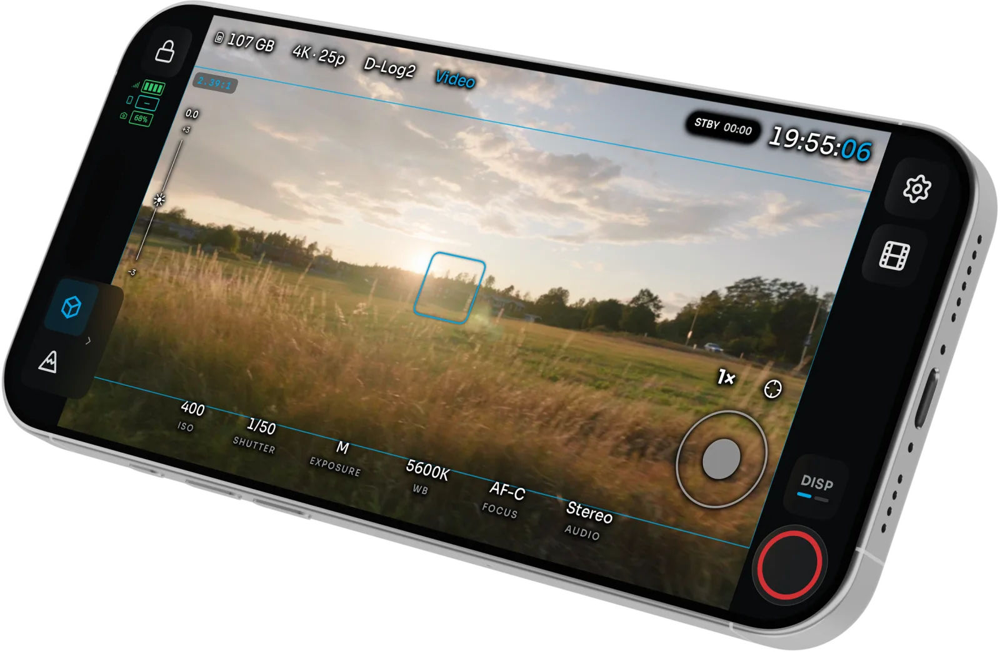
</a>

</div>

<details>
<summary><strong>Table of contents</strong></summary>

- [Supported cameras](#supported-cameras)
- [Features](#features)
- [See it in action](#see-it-in-action)
- [Install](#install)
- [In the press](#in-the-press)
- [Roadmap](#roadmap)
- [Free. Open source. Yours](#free-open-source-yours)
- [For developers](#for-developers)
  - [Built with](#built-with)
  - [Architecture](#architecture)
  - [Build from source](#build-from-source)
  - [Documentation](#documentation)
- [Contributing](#contributing)
- [Support](#support)
- [Credits](#credits)
- [License](#license)

</details>

## Supported cameras

| | Camera | Live view | Camera control | Gimbal | Notes |
| :---: | --- | :---: | :---: | :---: | --- |
| 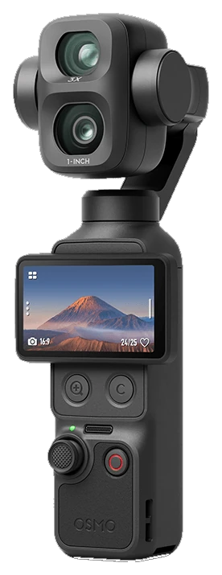 | **Osmo Pocket 4 Pro** | ✅ | ✅ | ✅ | Primary test camera. 1×/3× optical, 6×/12× zoom. D-Log2 hops to D-Log when you zoom. |
| 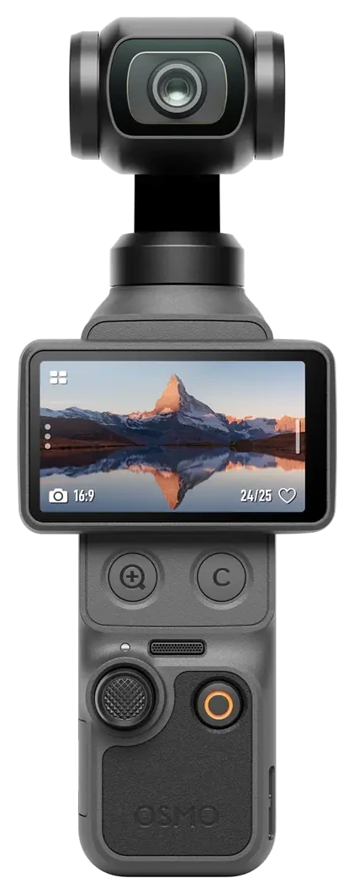 | **Osmo Pocket 4** | ✅ | ✅ | ✅ | 1×/2×/4× zoom. |
| 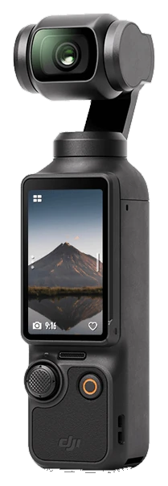 | **Osmo Pocket 3** | ✅ | ✅ | ✅ | The wider format and firmware matrix still needs testing. |
| 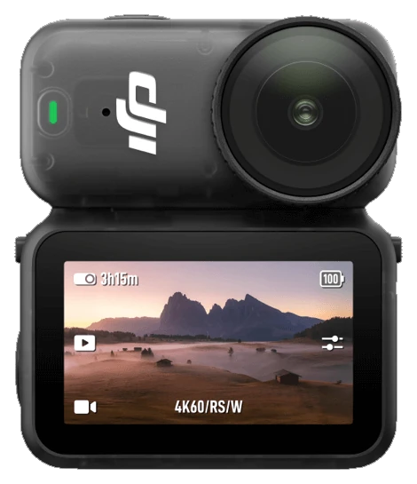 | **Osmo Nano** | ✅ | ✅ | – | Fixed 1× lens, so zoom controls are hidden. |
| 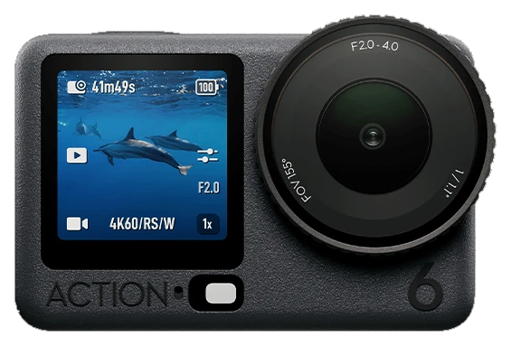 | **Osmo Action 6** | 🧪 | 🧪 | – | Built from a capture of the camera, not yet checked on one. Adds an APERTURE control. |

✅ works on iOS and Android · 🧪 built, not yet verified on the camera · – not on this camera.
Other Osmo models can appear in Bluetooth scan; other Action models and 360 live view are not captured yet.

> [!WARNING]
> Camera control is reverse-engineered and can be incomplete. Check that recording starts and
> stops on the camera body until you trust the link.

## Features

- **Read the image like a colorist.** Waveform, RGB parade, histogram and vectorscope run live
  beside the picture you are judging. Drag and resize them anywhere.
- **Catch exposure and focus before the take.** False color (CineStop, IRE and EL Zone), zebras,
  Traffic Lights, focus peaking, an EV meter, ND suggestions and LEVEL roll and tilt meters.
- **Frame once for every delivery.** Grids, aspect guides and a center crosshair, in landscape
  and portrait.
- **Run the camera from the phone.** Record, ISO, shutter, white balance, EV, zoom and FORMAT.
  Tap a face on the feed to start the camera's subject tracking.
- **Fly the gimbal.** On-screen stick or a game controller, Direction Lock, Double-tap Level,
  and experimental Motion Control moves.
- **Watch several cameras.** Experimental Multiview puts up to four Osmo cameras on one screen,
  with per-camera looks and group recording.
- **Review before striking the set.** Browse clips and stills on the camera, star the keepers,
  delete bad takes, and play back with the same scopes and assists as live view.
- **Ship it with the look baked in.** Built-in or custom `.cube` LUTs, Convert log on export,
  native share, and optional [Frame.io](https://www.frame.io/) upload with your own Adobe app keys.

iPhone and iPad are the daily driver. Android has the monitor, assists, camera and gimbal control,
Multiview and playback. **iOS only today:** LUT bake and Convert log on export, Frame.io upload,
feed sharing to other devices, Apple Watch, AirPods head tracking, and per-camera Wi-Fi and
Hotspot setups.

## See it in action

<table>
  <tr>
    <td width="50%" valign="top">
      <a href="https://openpocketcine.app/">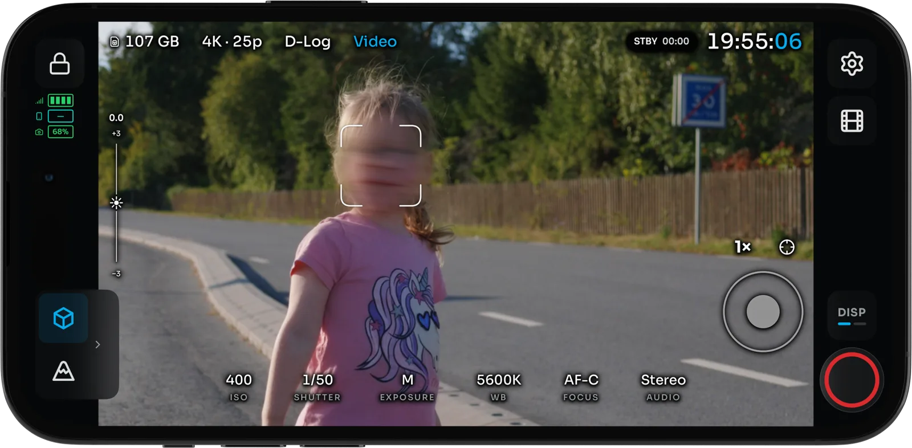</a>
      <br><strong>Face lock.</strong> Tap a face on the feed to start the camera's subject
      tracking, with histogram, zebras and a LUT still on.
    </td>
    <td width="50%" valign="top">
      <a href="https://openpocketcine.app/#scopes">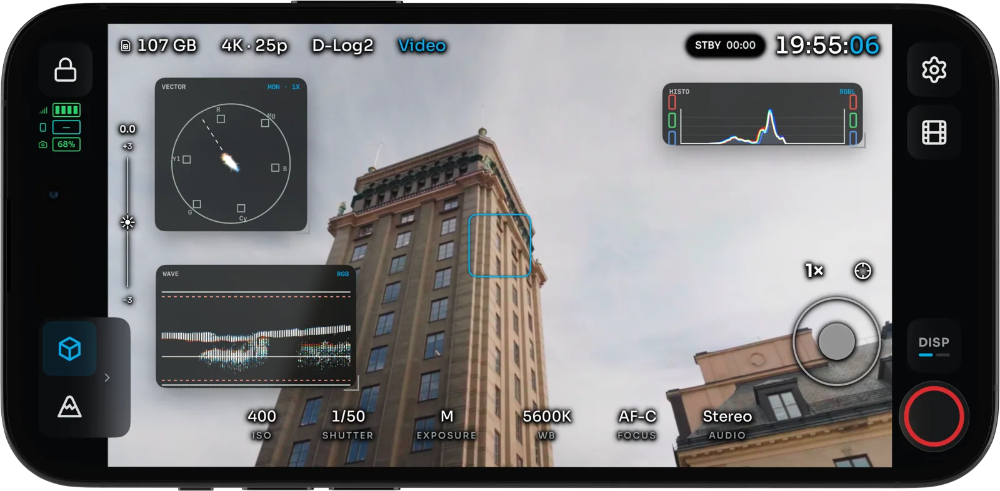</a>
      <br><strong>Scopes.</strong> Waveform, RGB parade, histogram and vectorscope beside the
      image, with Traffic Lights on the feed.
    </td>
  </tr>
  <tr>
    <td width="50%" valign="top">
      <a href="https://openpocketcine.app/#controls">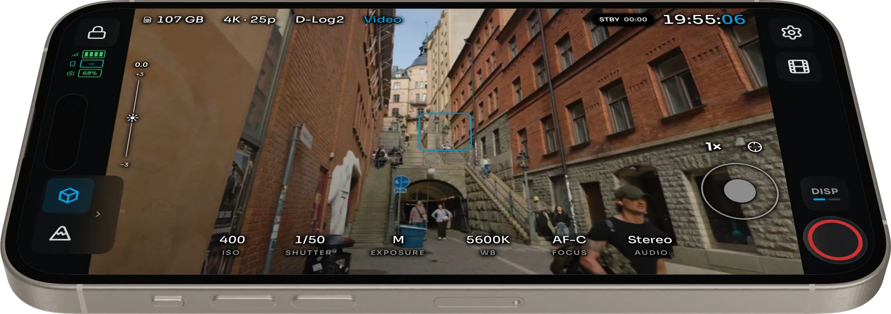</a>
      <br><strong>Camera control.</strong> Record, ISO, EV and zoom, plus the gimbal from an
      on-screen stick, a game controller or AirPods.
    </td>
    <td width="50%" valign="top">
      <a href="https://openpocketcine.app/#media">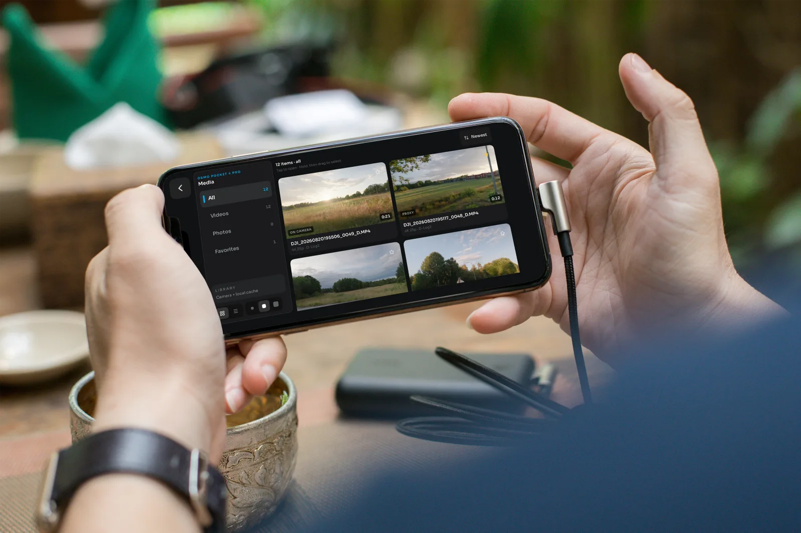</a>
      <br><strong>Media library.</strong> Browse clips and stills on the camera. Star the keepers
      and delete bad takes before you pack up.
    </td>
  </tr>
  <tr>
    <td width="50%" valign="top">
      <a href="https://openpocketcine.app/#playback">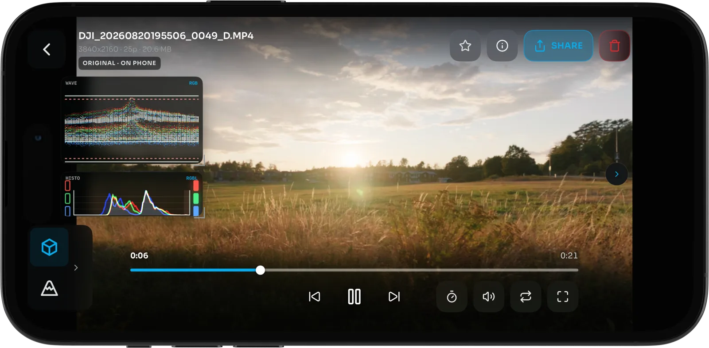</a>
      <br><strong>Playback.</strong> The same scopes and assists as live view, high-frame-rate
      clips at conform speed, and export with a baked LUT.
    </td>
    <td width="50%" valign="top" align="center">
      <a href="https://openpocketcine.app/#vertical">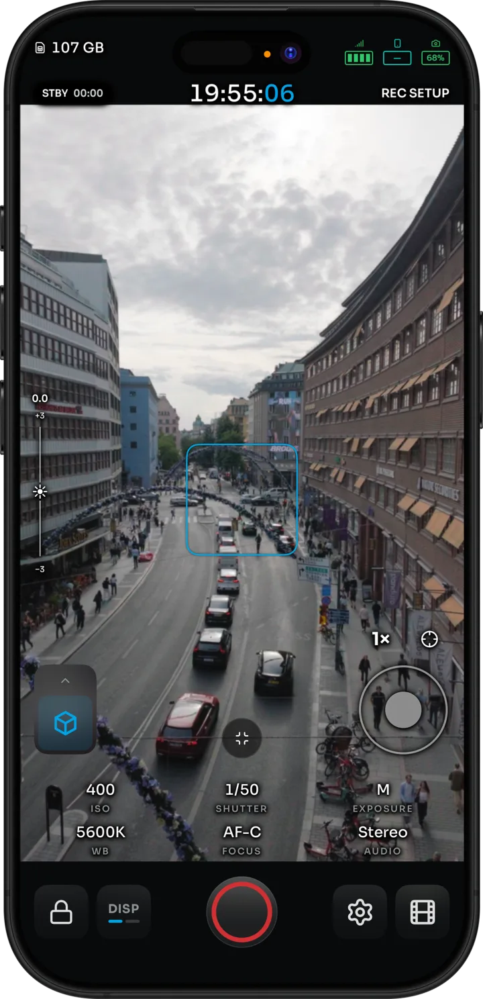</a>
      <br><strong>Vertical.</strong> The full assist rail works in portrait too.
    </td>
  </tr>
</table>

## Install

| Platform | How | Notes |
| --- | --- | --- |
| **iPhone and iPad** | [Join the TestFlight](https://testflight.apple.com/join/1tmt3aEB) | One universal app. |
| **Android** | [Public beta on Google Play](https://play.google.com/store/apps/details?id=com.opencapture.openpocketcine&hl=en-US&ah=mXzHtdYCMQTB83vt0jIRLnOOZaA) | Android 10 or newer, arm64. |
| **Android without Play** | [Sideload APK](https://github.com/erik-sutton95/OpenPocketCine/releases/tag/sideload-v0.1.5-2) (**0.1.5 (2)**) | For field monitors and devices without the Play Store. |

> [!NOTE]
> A sideload APK and a Google Play install are signed differently and cannot update each other.
> Remove the Play or APK-mirror copy before installing the APK.

Pairing and live view need a real camera nearby. See the
[iOS](https://openpocketcine.app/docs/apps/ios/) and
[Android](https://openpocketcine.app/docs/apps/android/) guides and the
[latest release notes](https://openpocketcine.app/docs/releases/0-1-5/).

## In the press

<table>
  <tr>
    <td width="33%" valign="top">
      <a href="https://www.cined.com/openpocketcine-free-open-source-field-monitor-app-brings-waveforms-false-color-and-luts-to-dji-osmo-cameras/">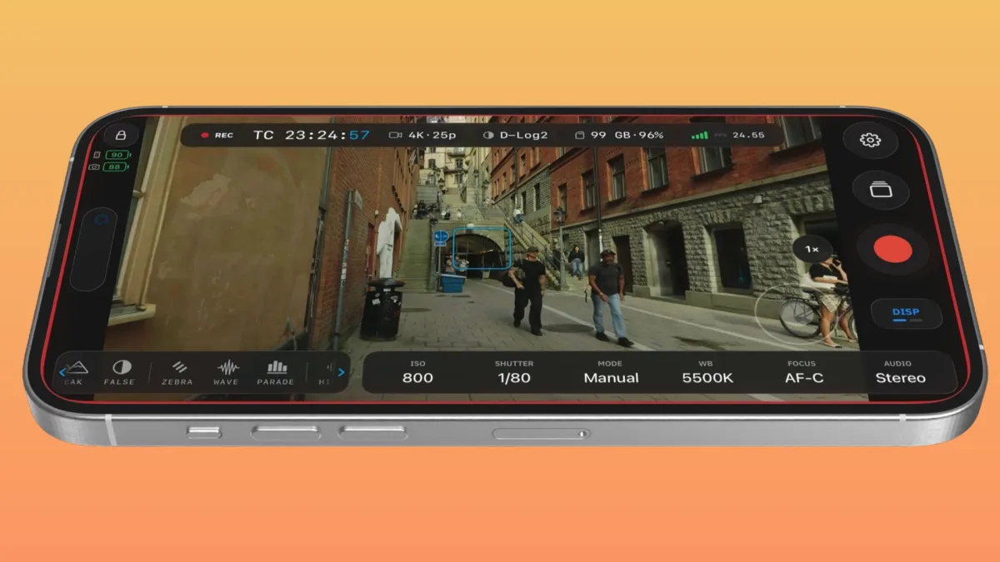</a>
      <br><strong>CineD</strong><br>Free open-source field monitor app brings waveforms, false color, and LUTs to DJI Osmo cameras
    </td>
    <td width="33%" valign="top">
      <a href="https://www.youtube.com/watch?v=8aMqWGNdKVU">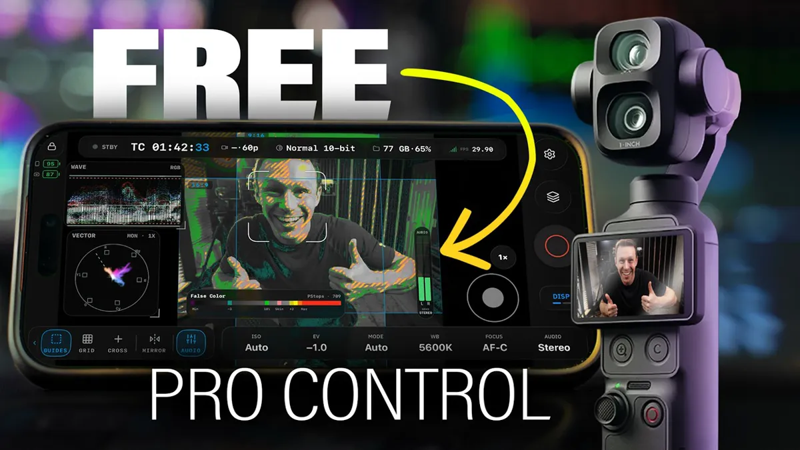</a>
      <br><strong>Colden Raisher</strong><br>OpenPocketCine review: free pro monitor app for DJI Pocket 4P
    </td>
    <td width="33%" valign="top">
      <a href="https://www.youtube.com/watch?v=b7YqWULguxA"></a>
      <br><strong>Blue Field Studios</strong><br>Finally! Pocket 4P Cinema Features
    </td>
  </tr>
</table>

Also covered by [Gadget Pilipinas](https://www.gadgetpilipinas.net/2026/08/openpocketcine-for-osmo-pocket/)
and [Mark Exploring New Stuff](https://www.youtube.com/watch?v=cqGz6-kFcDA).

## Roadmap

The roadmap lives in [GitHub Discussions](https://github.com/erik-sutton95/OpenPocketCine/discussions).
Browse the [Ideas category](https://github.com/erik-sutton95/OpenPocketCine/discussions/categories/ideas)
to vote, add production context, or propose what to tackle next. Roadmap threads describe
direction, not promised dates. Engineering-phase detail lives in [`docs/ROADMAP.md`](docs/ROADMAP.md).

## Free. Open source. Yours

No subscriptions, no paywalls, no advertising, and no tracking. Crash reports are opt-in.
OpenPocketCine is Apache-2.0 licensed and built in public with the latest frontier models (Grok,
Codex and Claude), so filmmakers and developers can inspect, improve and adapt the tool they rely
on. Engineering guidelines live in [`AGENTS.md`](AGENTS.md).

## For developers

### Built with

[](https://www.swift.org/) [](https://developer.apple.com/xcode/swiftui/) [](https://developer.apple.com/metal/) [](https://kotlinlang.org/) [](https://developer.android.com/compose) [](https://www.vulkan.org/)

### Architecture

A shared Swift business and protocol core with native platform shells:

| Layer | Path | Purpose |
| --- | --- | --- |
| **Shared core** | `Sources/OpenPocketViewCore/` | DUML framing, datalink, BLE adverts, commands, status |
| **iOS app** | `ios/OpenPocketCine/` | SwiftUI shell, CoreBluetooth, Hotspot Configuration, VideoToolbox |
| **Android app** | `Apps/Android/app/` | Jetpack Compose phone shell and Android platform adapters |
| **Android facade** | `Sources/OpenPocketCineAndroidFacade/` | Swift session and JNI boundary for Android |
| **Tests** | `Tests/OpenPocketViewCoreTests/` | Swift package tests: framing, transport, discovery, layout |

The shared core owns protocol logic and stays portable (no SwiftUI, UIKit or Android
dependencies). Platform shells own sockets, permissions, lifecycle, rendering and UI. See
[`docs/ARCHITECTURE.md`](docs/ARCHITECTURE.md).

### Build from source

Tooling runs through [`just`](https://github.com/casey/just):

```bash
just setup          # install meta-check tools (macOS / Homebrew)
just                # list all recipes
just check          # run repository quality checks
just test           # run Swift package tests
just native-check   # run Swift tests and build the native iOS app
just android-check  # build, test, and lint Android
just handbook       # docs at http://127.0.0.1:4321/
```

The iOS Xcode project is generated:

```bash
cd ios && xcodegen generate && open OpenPocketCine.xcodeproj
```

> [!TIP]
> The Simulator and emulators have no Bluetooth or camera Wi-Fi. Pairing and live view need a
> physical iPhone or Android phone and a camera.

Releases: TestFlight archives come from Xcode Cloud ([`docs/testflight-ci.md`](docs/testflight-ci.md)).
Play closed testing and the sideload APK are in [`docs/android-play-ci.md`](docs/android-play-ci.md).

### Documentation

- **[Docs](https://openpocketcine.app/docs/)**: protocol, iOS and Android apps, and how to build.
  Keep them current in the same PR ([standard](https://openpocketcine.app/docs/contribute/documentation/)).
- [`docs/ARCHITECTURE.md`](docs/ARCHITECTURE.md): shared Swift core and platform shells
- [`docs/PARITY.md`](docs/PARITY.md): operator-visible iOS / Android contract
- [`docs/PERFORMANCE.md`](docs/PERFORMANCE.md): live-path SLOs (frame rate, ACK, HUD)
- [`docs/UX.md`](docs/UX.md): FTUE, operator copy, help, failure states
- [`docs/RELEASE.md`](docs/RELEASE.md): `main` + PRs + `v*` tags (no Git Flow)
- [`AGENTS.md`](AGENTS.md): always-loaded index for coding agents

OpenPocketCine went through an extended private R&D phase before publication; the public
repository starts from a squashed initial commit rather than carrying the experimental history.

## Contributing

Contributions are welcome.

- Read [`CONTRIBUTING.md`](CONTRIBUTING.md) for the development workflow, code standards, and how
  to report bugs vs. request features.
- Bugs go in [GitHub's bug-report form](https://github.com/erik-sutton95/OpenPocketCine/issues/new?template=bug_report.yml).
  Never put camera Wi-Fi passwords or captures in an issue.
- Ideas and questions go in **GitHub Discussions**:
  [Ideas](https://github.com/erik-sutton95/OpenPocketCine/discussions/categories/ideas) and
  [Q&A](https://github.com/erik-sutton95/OpenPocketCine/discussions/categories/q-a).
- Please read the [`CODE_OF_CONDUCT.md`](CODE_OF_CONDUCT.md). For security issues, see
  [`SECURITY.md`](SECURITY.md).

<a href="https://github.com/erik-sutton95/OpenPocketCine/graphs/contributors">
  
</a>

## Support

I truly appreciate everyone who uses this project, files an issue, or sends a patch. Optional
[Buy Me a Coffee](https://buymeacoffee.com/eriksutton) contributions help keep the lights on. If
you would rather give to a charity, especially one that helps animals, that is just as welcome.

## Credits

I learned the BLE pairing and camera Wi-Fi connection path with the help of
[Osmosis](https://github.com/KonradIT/osmosis) by Konrad Iturbe, a generous open Android client for
Osmo cameras. I'm grateful. OpenPocketCine is its own implementation; Osmosis was inspiration for
that connection story, not a source I copied. If you care about talking to Osmo cameras, Konrad's
work is worth your time.

## License

[Apache 2.0](LICENSE). Third-party licenses are listed in
[`THIRD-PARTY-NOTICES.md`](THIRD-PARTY-NOTICES.md). The app's privacy policy lives at
[openpocketcine.app/privacy](https://openpocketcine.app/privacy/).

This project is not affiliated with or endorsed by SZ DJI Technology Co., Ltd. No DJI SDK or
proprietary documentation is included in, distributed with, or required by this project.
"DJI", "Osmo", "Osmo Pocket", "Osmo Action", "Osmo Nano", and "Mimo" are trademarks of
SZ DJI Technology Co., Ltd., used here for identification only.
